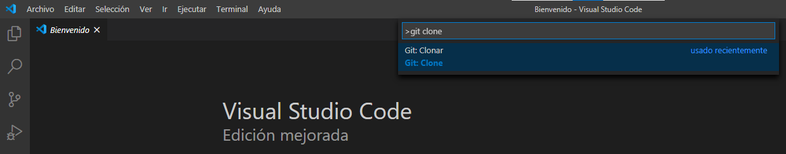
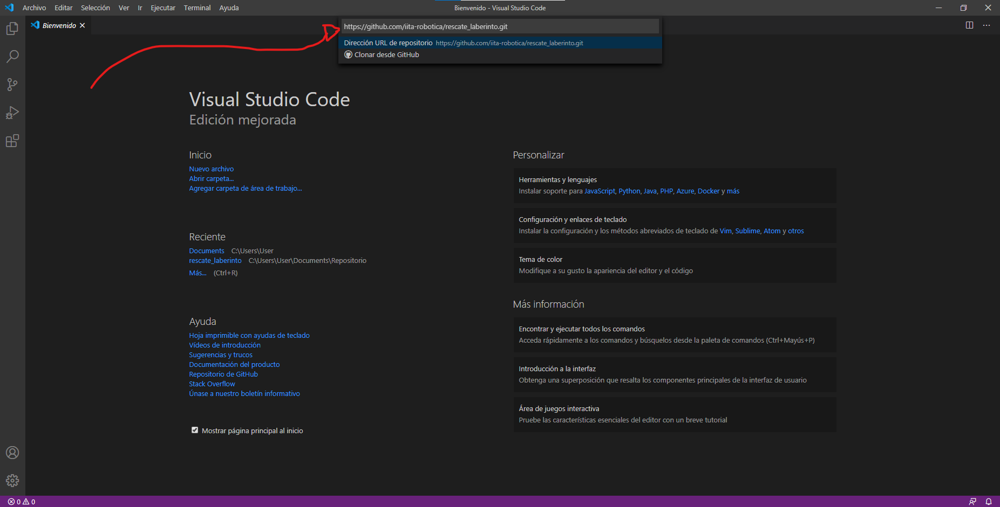
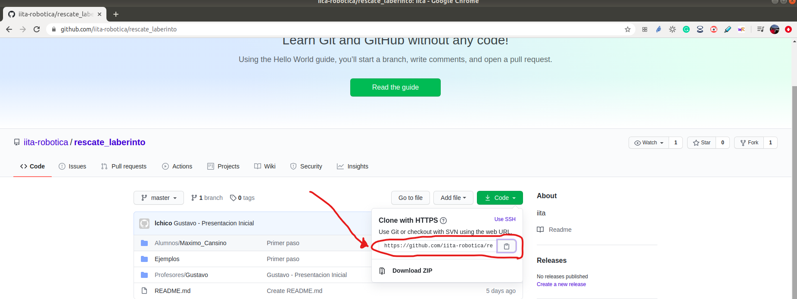
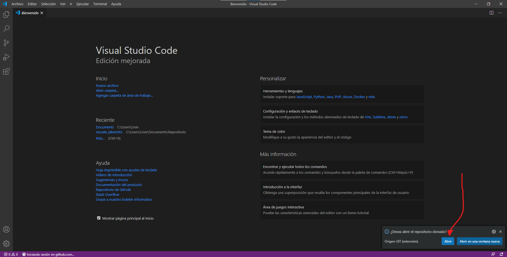
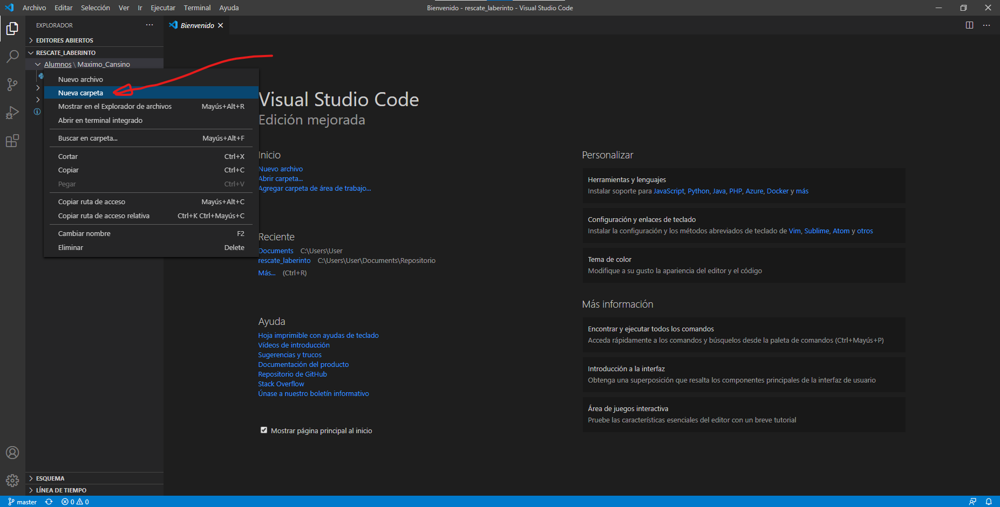
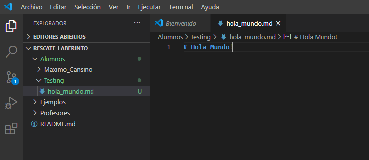
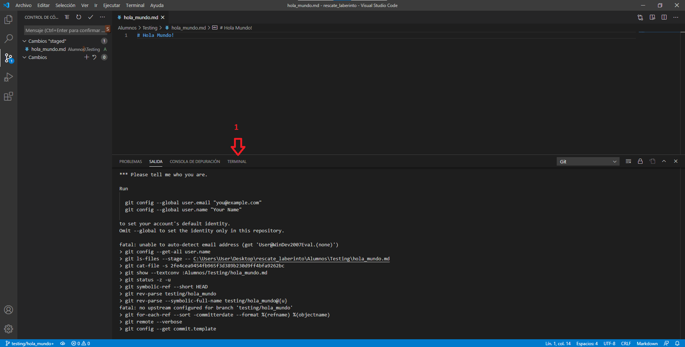
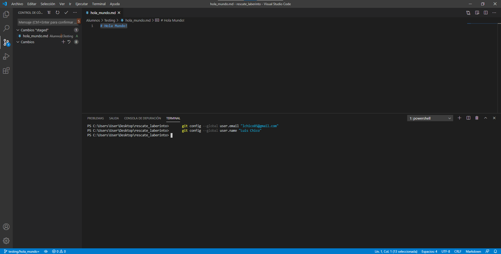
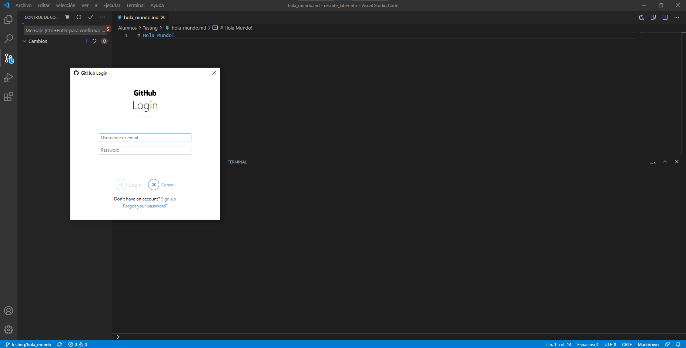

- [Como usar git en visual code](#como-usar-git-en-visual-code)
- [Instalar visual code](#instalar-visual-code)
  * [Visual Code](#visual-code)
- [Instalar git](#instalar-git)
- [Como descargar nuestro repositorio desde Visual Code](#como-descargar-nuestro-repositorio-desde-visual-code)
- [Como subir nuestros archivos al repositorio](#como-subir-nuestros-archivos-al-repositorio)

# Como usar git en visual code
 
## Instalar visual code
  
Es un editor de código fuente, desarrollado por Microsoft para Windows , Linux y macOS. Incluye soporte para la depuración, control integrado de Git, resaltado de sintaxis, finalización inteligente de código, fragmentos y refactorización de código. También es personalizable, por lo que los usuarios pueden cambiar el tema del editor, los atajos de teclado y las preferencias. Es gratuito y de código abierto.
 
* Link para descargarlo [haz click aqui](https://code.visualstudio.com/Download).
 
* En [este video](https://www.youtube.com/watch?v=HVzFLw5r2EM) se explica detalladamente todos los pasos a seguir para instalarlo. Está explicado como instalar la extensión para que les aparezca todo en castellano.
 
Una vez instalado visual code vamos a instalar git, para poder acceder a nuestro repositorio mediante visual code.
 
## Instalar git
 
Para poder utilizar git en Visual Code debemos instalar Git. Para eso vamos al sitio oficial.
 
* Link para descargar [haz click aqui](https://git-scm.com/downloads).
 
* En [este video]https://www.youtube.com/watch?v=ES2xtLyI-B8 se explica detalladamente todos los pasos a seguir para instalarlo.
 
# Utilizar git en Visual Code

## Como descargar nuestro repositorio desde Visual Code
 
Una vez que tenemos Visual Code y Git instalado podemos descargar nuestro repositorio utilizando Visual Code, para ello hacemos lo siguiente:
 
1. Abrimos Visual Code y presionamos Ctrl + Shift + P 
 
    
 
2. Desde ahí tecleamos git clone 
 
     
 
    y nos pide la ruta del repositorio que queremos clonar. Este va a ser nuestro repositorio cuya url es:
    *https://github.com/iita-robotica/rescate_laberinto.git*
    
    
 
    Presionamos enter. La url se obtiene de:
 
     
 
    Luego de presionar enter nos debería mostrar donde queremos guardar el repositorio. Seleccionamos la ubicación. Y comenzará a descargar el repositorio.
    Visual Code nos dará la opción de abrir el repositorio. Para ello presionamos abrir:
    
    
 
## Como subir nuestros archivos al repositorio
 
1. Primero vamos a crear nuestra carpeta donde vamos a estar subiendo nuestro archivos, para ello vamos a Alumnos y hacemos click derecho en "Nueva Carpeta" donde pondremos nuestro nombre. En este ejemplo voy a usar el nombre "Testing"
 
    
 
2. Una vez creada la carpeta con nuestro nombre, vamos a crear nuestro archivo de bienvenida. 
 
- Para esto vamos sobre la carpeta que creamos (en este caso "Testing"), que debería estar dentro de la carpeta Alumnos.
- Hacemos click derecho y seleccionamos la opción "Nuevo Archivo"
    
    
 
- Le ponemos el nombre del archivo, por ejemplo "hola_mundo.md"
- Dentro del archivo "hola_mundo.md" escribimos: "# Hola Mundo!"
- Con las teclas Ctrl + s => Guardamos los cambios realizados. (Lo mismo que ir archivo-> Guardar)
 
    
 
Bueno como podemos ver a la izquierda todos los cambios que realizamos, se muestra en color verde. 
Todo esto es lo que tenemos diferente al repositorio remoto.
 
3. Estos cambios los vamos a agregar en nuestra rama ( o branch) de trabajo.
 
Para esto vamos a crear dicha rama haciendo nuevamente: 
1. Ctrl + shift + P
    - Y ponemos: git branch -> Seleccionamos la opción *Crear rama* 
    - Luego le vamos a definir el nombre de la rama. Como convención vamos a utilizar nuestro nombre o apodo. 
        Ej.: testing/hola_mundo
2. Una vez hecho esto hacemos los pasos 1 y 2 que muestra la siguiente imagen:
    
    
 
3. Si el paso anterior fue realizado con éxitos veremos lo mismo que en la siguiente imagen:
    1. El archivo nuevo ahora tiene un A. (Significa que el archivo fue agregado al repositorio local)
    2. Hacemos click en el tilde, indicado por la flecha con el número 2. Esto va a confirmar que queremos agregar dichos cambios.
    3. Nos solicitará agregar un mensaje donde pondremos una muy breve descripción de lo que hicimos.
        Ej. Agregamos hola mundo.
    
    
 
4. Por ser la primera vez esto va a fallar por necesitamos configurar git para identificar quien está realizando los cambios.
    En la salida veremos algo como esto:
    
    
    
    Como lo indica la imagen anterior vamos a 1 *TERMINAL* y configuraremos git con nuestros datos:
    ```bash
      git config --global user.email "lchico85@gmail.com"
      git config --global user.name "Luis Chico"
    ```
    Nos debería quedar de la siguiente manera:
    
    
 
5. Ahora si volvemos a realizar el paso *3.3* => Presionar sobre el tilde y agregar como mensaje: `Agregamos hola mundo.`
6. Ahora solo queda subir los cambios a la nube (Repositorio remoto). Para ello vamos a hacer:
    
    
 
    1. Presionamos sobre los `...` como indica la flecha 1.
    2. Vamos a *Pull, Push* , indicado por la flecha 2.
    3. Vamos a Sincronizar, indicado por la flecha 3.
 
7. Ahora deberemos loguearnos con nuestra cuenta de github. Deberemos completar lo siguiente:
 
    
 
Y con esto ya deberíamos haber podido subir nuestro primer archivo al repositorio.
